# Análisis Exploratorio de Datos - TelcoCustomerChurn 🚀


**TelcoCustomerChurn** es una aplicación que permite aplicar de manera integrada los conceptos vistos a lo largo del curso, desarrollando una herramienta funcional, clara y bien estructurada, similar a un producto analítico real..

Puedes acceder a la aplicación en el siguiente enlace: 

🌐 [TelcoCustomerChurn](https://proyecto2.streamlit.app/)

---

## 🚀 Introducción

Bienvenido a **TelcoCustomerChurn**, una herramienta que nos muestra gráficos estadisticos, numéricos y categóricos. Aplicación de clases, gráficos de barras, histogramas.

<div align="center">
    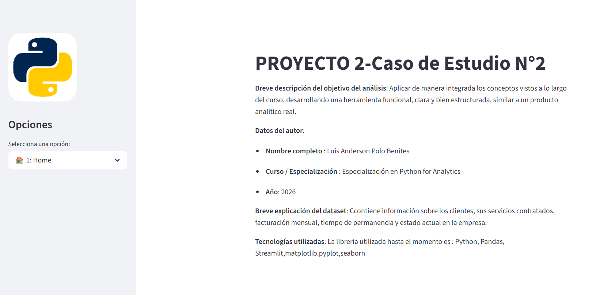
    
</div>

---

## 📈 Descripción del Proyecto

Este proyecto ofrece:

Variables y tipos de datos
- Funciones
- f-strings
- Programación Orientada a Objetos (POO)
- NumPy y Pandas
- Visualización con Matplotlib y Seaborn
- Estadística descriptiva
  
---

## 🛠️ Requisitos

Para ejecutar la aplicación necesitas tener instalados los siguientes paquetes:

- streamlit
- pandas>=2.1.4
- numpy
- openpyxl
- plotly
- matplotlib
- seaborn


Puedes instalar todos los requisitos usando el archivo `requirements.txt`:

```bash
pip install -r requirements.txt
```
---

## 📷 Captura de pantalla

<div align="center">
    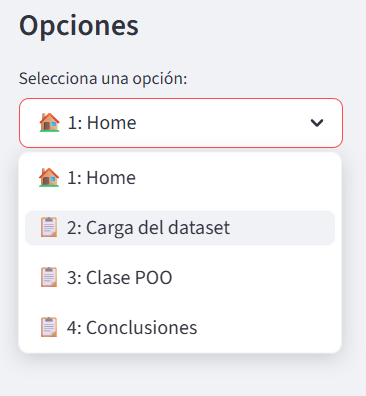
    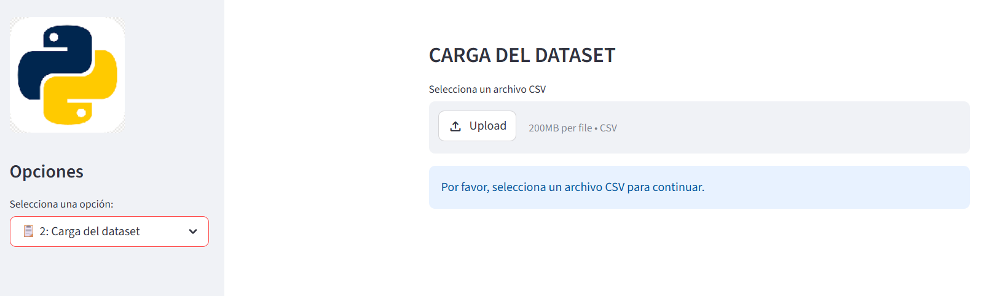
    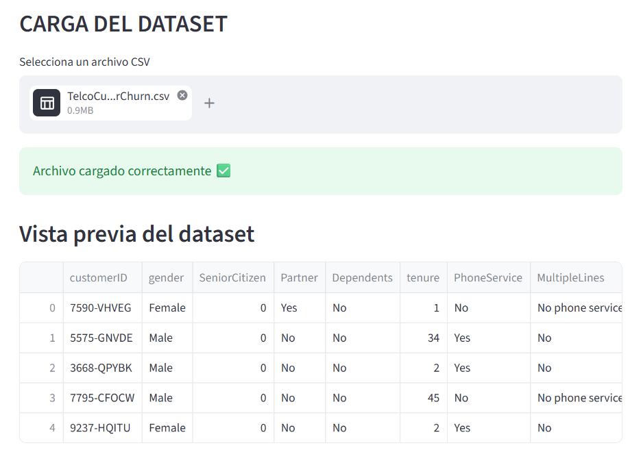
    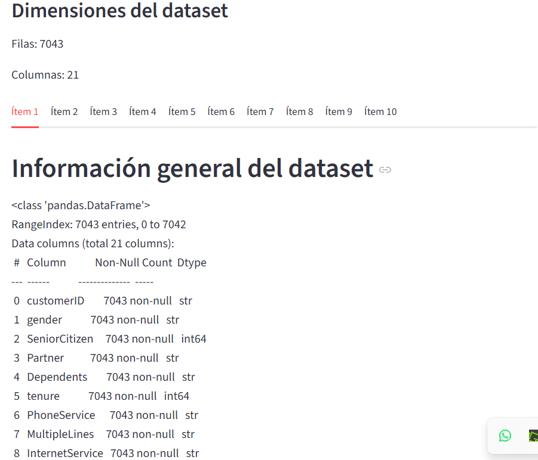
    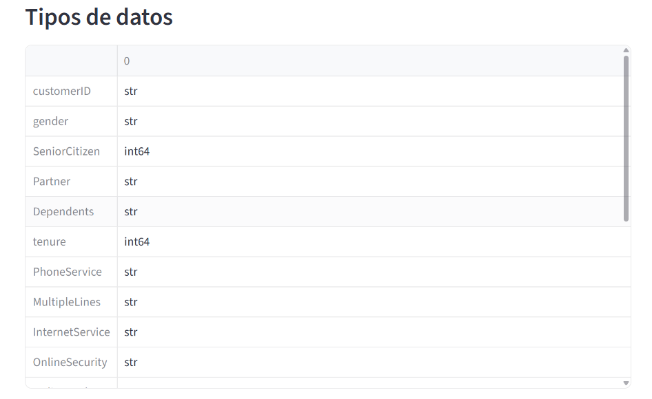
    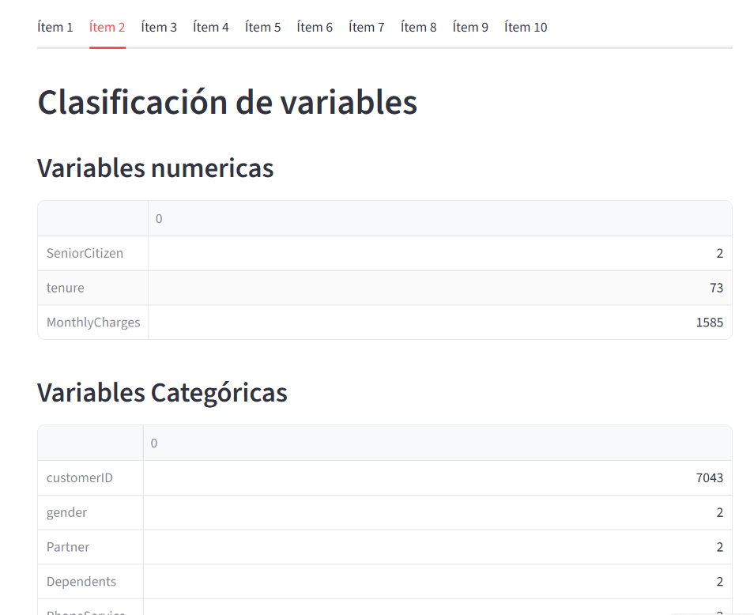
    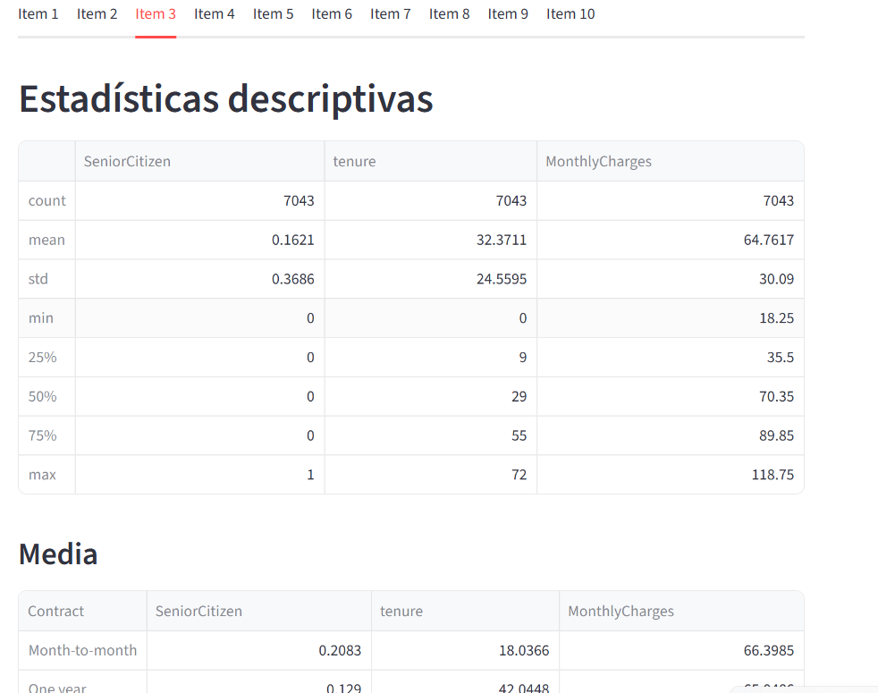
    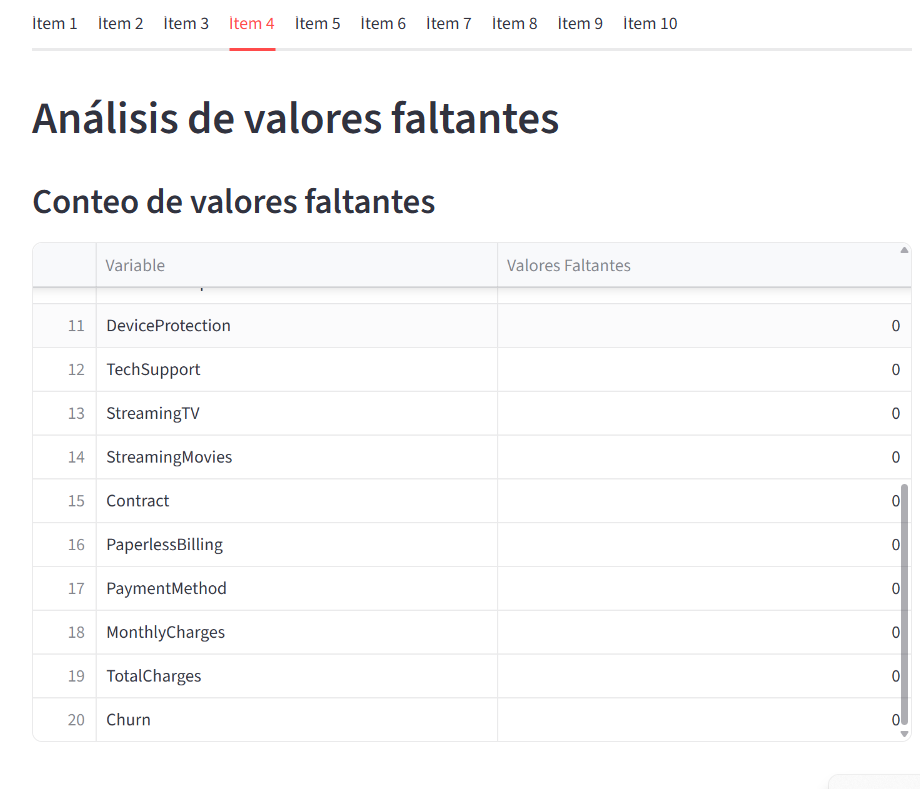
    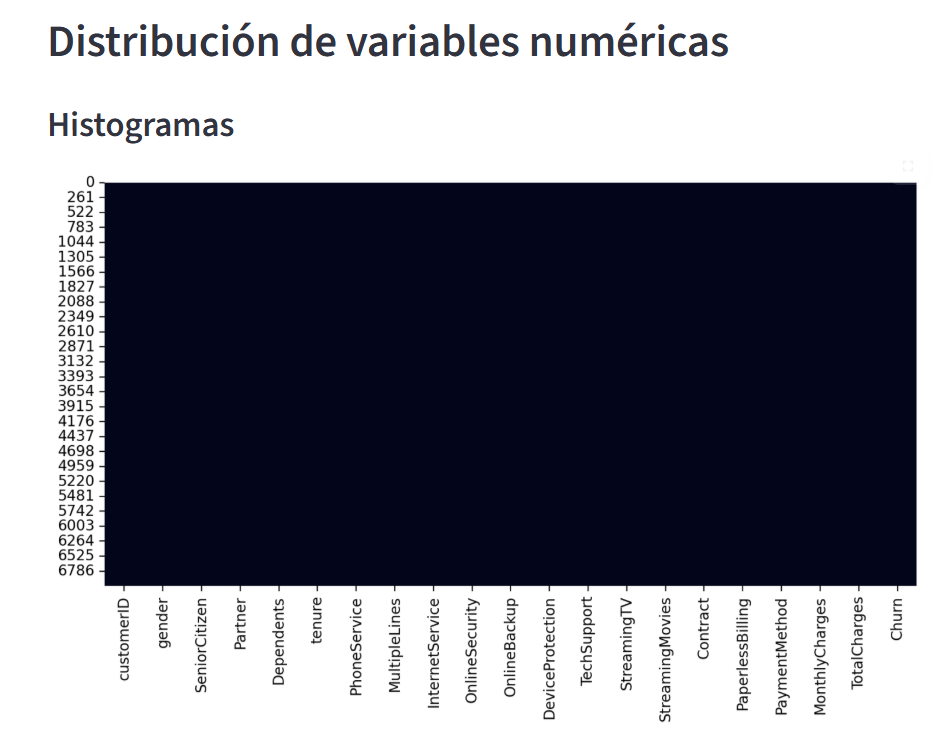
    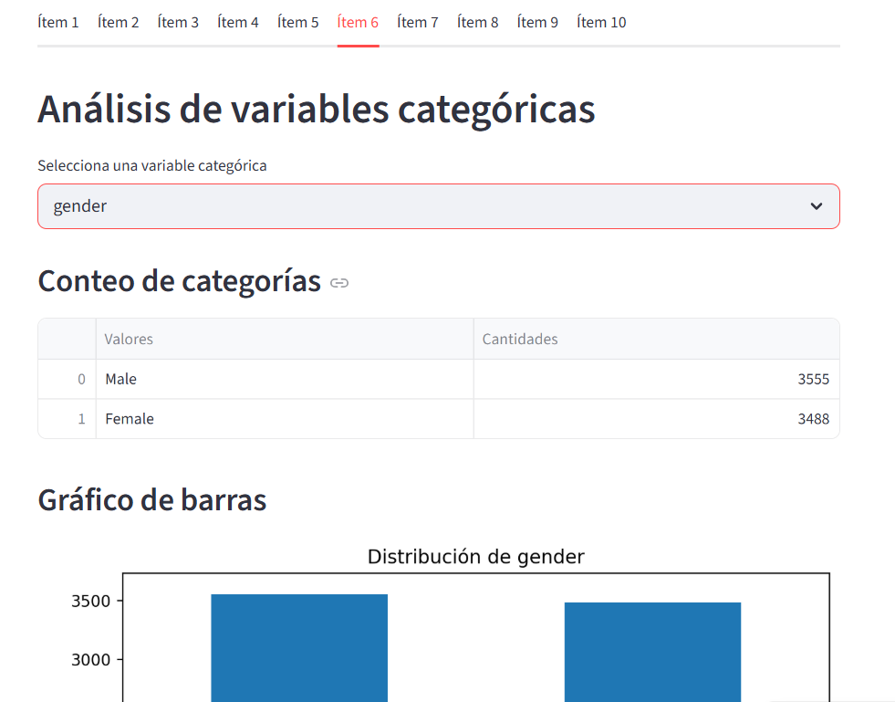
    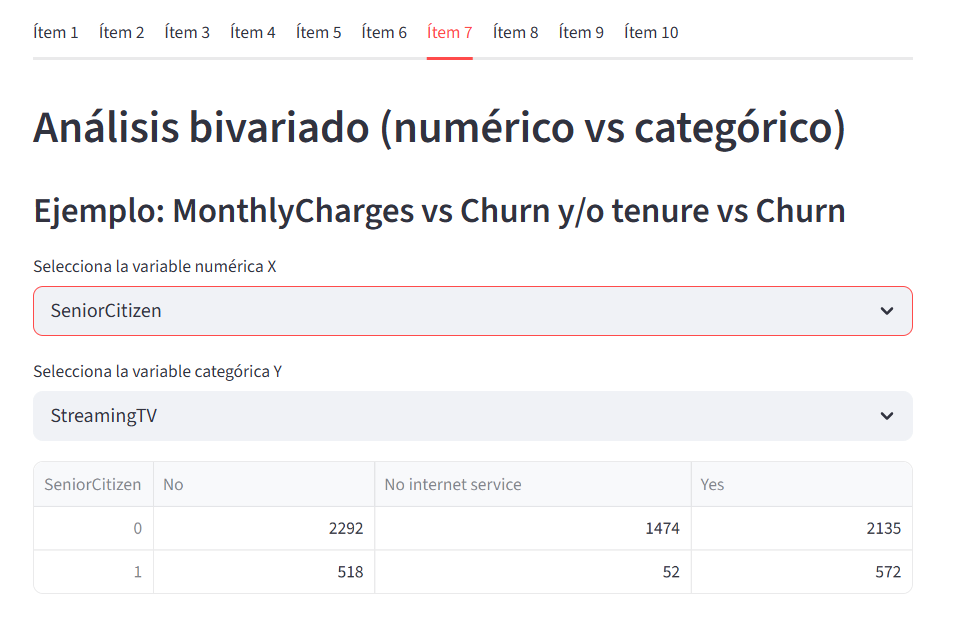
    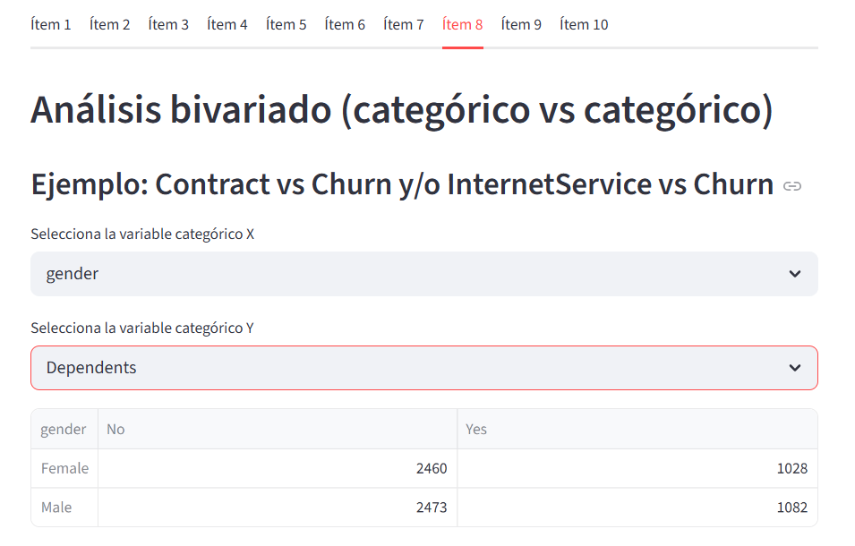
    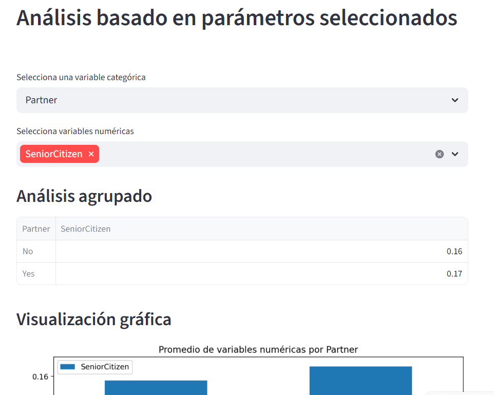
    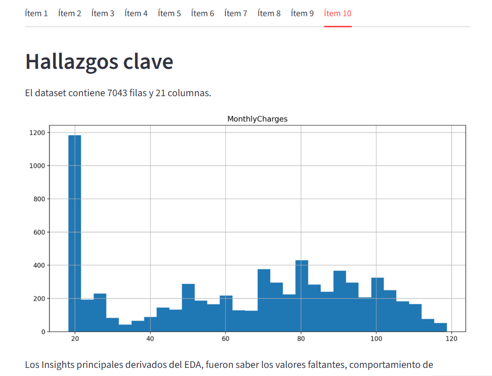

</div>

---

## ⚙️ Uso

### Ejecutar la aplicación:

```bash
streamlit run app.py
```

---

### 🤝 Contribuciones

Si deseas contribuir a este proyecto:

1. Haz un fork del repositorio.
2. Crea una nueva rama para tus cambios (`git checkout -b feature/nueva_funcionalidad`).
3. Haz commit de tus cambios (`git commit -am 'Añadir nueva funcionalidad'`).
4. Haz push de tu rama (`git push origin feature/nueva_funcionalidad`).
5. Crea un Pull Request.

---

## 🗂️ Estructura de Archivos

```bash
TelcoCustomerChurn/
│
├── app.py               # Control principal de la aplicación.
├── libreria_clase.py        # Libreria de clases.
├── logo7.png
├── images/
│   ├── pantalla_principal.png
│   ├── opciones.png
│   ├── opcion2.png
│   ├── opcion2_1.png
│   ├── opcion2_2.png
│   ├── opcion2_3.png
│   ├── opcion2_4.png
│   ├── opcion2_5.png
│   ├── opcion2_6.png
│   ├── opcion2_7.png
│   ├── opcion2_8.png
│   ├── opcion2_9.png
│   ├── opcion2_10.png
│   ├── opcion2_11.png
│   ├── opcion2_12.png
├── TelcoCustomerChurn.csv      # Archivo de carga.
├── requirements.txt      # Archivo con las dependencias del proyecto.
├── README.md             # Archivo con la descripción del proyecto.
```

---

## 📝 Licencia

Este proyecto está bajo la licencia MIT. ¡Siéntete libre de usarlo, mejorarlo y compartirlo!
